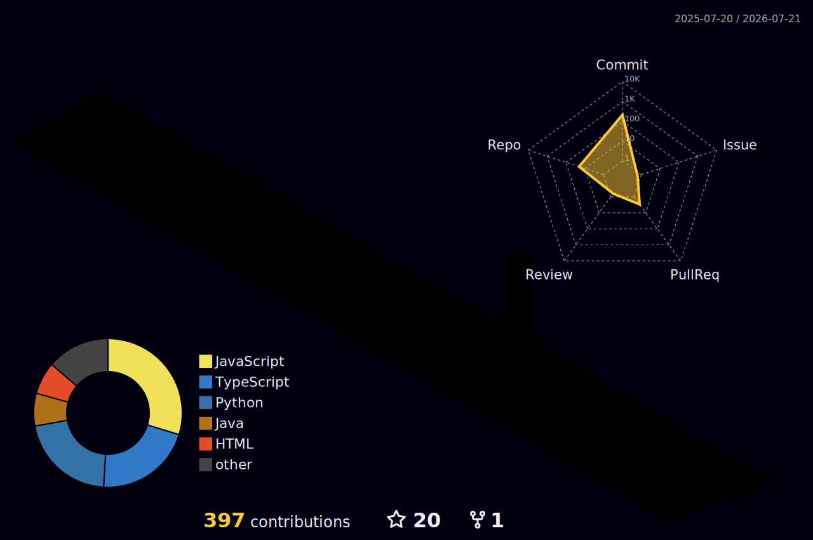

<div align="center">



```
$ whoami
Manisha Gangadevi

$ cat role.txt
Full-Stack + AI/ML Engineer
Final-year CSE (AI & ML) · CGPA 8.39 · Hyderabad, India

$ status --current
Open to internships and full-time roles
```

</div>

**[Portfolio](https://manishagangadevi-portfolio.vercel.app)** · **[Resume](https://drive.google.com/file/d/1mlI1_bPdFcf60ObfkskdRZO0q0Otlhl4/view?usp=sharing)** · **[LinkedIn](https://www.linkedin.com/in/manisha223685/)**

---

### Stack


---

### Stats

<div align="center">


</div>

---

📫 **manishagangadevi1@gmail.com**
